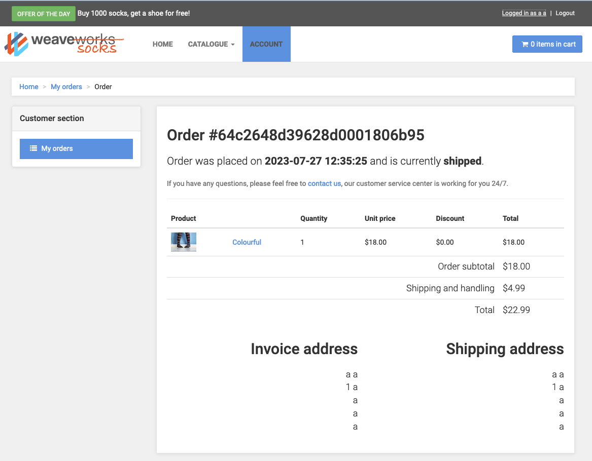

## Sock Shop : A Microservice Demo Application

The application is the user-facing part of an online shop that sells socks. It is intended to aid the demonstration and testing of microservice and cloud native technologies.

It is built using [Spring Boot](http://projects.spring.io/spring-boot/), [Go kit](http://gokit.io) and [Node.js](https://nodejs.org/) and is packaged in Docker containers.

This repository is a multiarchitecture compute version of the microservices demonstration.

### Purpose

The purpose of this application is to use a reference microservices demo to show a real-life multiarchitecture compute.

### Applications
1. [front-end](https://github.com/microservices-demo/front-end)
2. [orders](https://github.com/microservices-demo/orders)
3. [payment](https://github.com/microservices-demo/payment)
4. [user](https://github.com/microservices-demo/user)
*user-db* is Intel only.
5. [catalogue](https://github.com/microservices-demo/catalogue) *catalogue-db* is Intel only.
6. [cart](https://github.com/microservices-demo/carts)
7. [shipping](https://github.com/microservices-demo/shipping)
8. [queue-master](https://github.com/microservices-demo/queue-master)

The `catalogue` and `user` have a built-in wait to READY as the dependent databases are started up.

Unless mentioned, each image is cross-compiled in s390x, amd64, arm64, and ppc64le. The image is manifest-listed.

### Deployment

*fyre* 

To deploy to fyre, use the following:

1. Update manifests/overlays/fyre/env.secret with username and password:

```
username=
password=
```

2. Build sock shop for fyre:

```
❯ kustomize build manifests/overlays/fyre | oc apply -f - 
```

3. Destroy sock shop for fyre:

```
❯ kustomize build manifests/overlays/fyre | oc delete -f - 
```

*multiarch compute*

To deploy to a multiarch compute cluster, use the following:

1. Update manifests/base/env.secret with username and password:

```
username=
password=
```

2. Build sock shop for multi:

```
❯ kustomize build manifests/overlays/multi | oc apply -f - 
```

3. Destroy sock shop for multi:

```
❯ kustomize build manifests/overlays/multi | oc delete -f - 
```

### Using the application

1. Get the route to the host

```
❯ oc get routes -n sock-shop
NAME        HOST/PORT                                                 PATH   SERVICES    PORT   TERMINATION   WILDCARD
sock-shop   sock-shop.apps.demo.xyz          front-end   8079   edge/None     None
```

2. Navigate to https://sock-shop.apps.demo.xyz

3. Pick a test user from [User Accounts](https://microservices-demo.github.io/docs/user-accounts.html)

Have fun and use it.

### Images

The applications are compiled into images that are hosted at [quay.io/repository/cbade_cs/openshift-demo](https://quay.io/repository/cbade_cs/openshift-demo?tab=tags). There is a manifest-listed image for each application.

To build the images, use: 

*amd64*

```
ARCH=amd64
REGISTRY=quay.io/repository/cbade_cs/openshift-demo
make cross-build-amd64
```

*All other arches*

```
ARCH=ppc64le
REGISTRY=quay.io/repository/cbade_cs/openshift-demo
make cross-build-amd64
```

To push the manifest-listed images, use:

```
REGISTRY=quay.io/repository/cbade_cs/openshift-demo
ARM_REGISTRY=quay.io/repostiroy/pbastide_rh/openshift-demo
APP=front-end
make push-ml
```

The architecture is:


The application looks like: 



### Development

The following custom repos are used: 

- front-end - https://github.com/ocp-power-demos/sock-shop-front-end
- user - https://github.com/ocp-power-demos/sock-shop-user
- orders - https://github.com/ocp-power-demos/sock-shop-orders


### Using

Please login in via the https route to sock-shop and register a new user.

### Testing the Multiarchitecture Compute
1. [e2e-test](https://github.com/microservices-demo/e2e-tests)
2. [load-test](https://github.com/microservices-demo/load-test)

Thank you to the WeaveWorks team and supporters.

### References
1. https://microservices-demo.github.io/
2. https://medium.com/ibm-cloud/tracing-and-profiling-microservices-application-deployed-on-ibm-cloud-private-fe1f4c274329